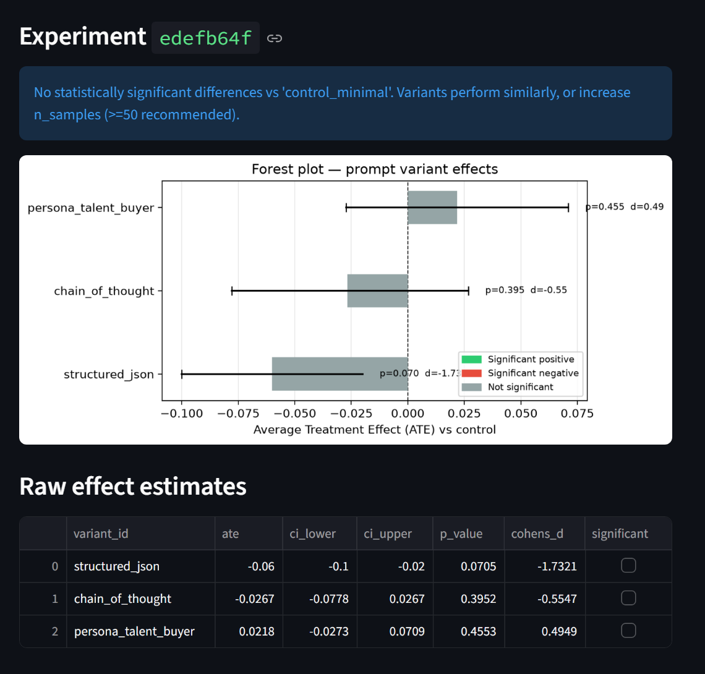

# Causal LLM Evaluator

Every ML team argues about prompts. Almost none of them can prove who's right.

This evaluator borrows the randomised trial design from clinical medicine and applies it to LLM prompt engineering — so instead of "this one scored higher on my laptop," you get a p-value, a confidence interval, and an effect size that tells you whether the difference is real and whether it's worth shipping.

This evaluator treats prompt A/B testing as a proper randomised experiment:

- **p-value** — is the difference statistically real, or noise?
- **Cohen's d** — is the effect size practically meaningful?
- **95% bootstrap CI** — what's the plausible range of true effects?

---



---

## Stack

| Layer | Tech |
|---|---|
| API | FastAPI + Pydantic v2 |
| LLM calls | Anthropic SDK / Groq SDK |
| Statistics | SciPy (Welch's t-test) + NumPy (bootstrap CI) |
| Scoring | LLM-as-judge (Haiku / Llama) or ROUGE-L |
| Persistence | SQLite + JSONL experiment log |
| Dashboard | Streamlit (forest plot) |
| Packaging | uv |

---

## Setup

```bash
git clone <repo>
cd causal-llm-evaluator

# install dependencies
uv sync --no-install-project

# configure keys
cp .env.example .env
# edit .env — add ANTHROPIC_API_KEY and/or GROQ_API_KEY
```

---

## Running

**Terminal 1 — API server:**
```bash
uv run uvicorn app.main:app --reload
```

**Terminal 2 — Dashboard:**
```bash
uv run streamlit run frontend/dashboard.py
```

- API docs: `http://localhost:8000/docs`
- Dashboard: `http://localhost:8501`

---

## API

### `POST /experiment`

Run a randomised prompt A/B test.

```json
{
  "variants": [
    {
      "id": "control",
      "system_prompt": "You are a helpful assistant.",
      "user_template": "Summarise: {input}"
    },
    {
      "id": "chain_of_thought",
      "system_prompt": "Think step by step before answering.",
      "user_template": "Summarise: {input}"
    }
  ],
  "test_inputs": ["...text 1...", "...text 2..."],
  "n_samples": 30,
  "scorer": "llm_judge",
  "provider": "anthropic"
}
```

**Response:**
```json
{
  "experiment_id": "a3f7c2b1",
  "control_id": "control",
  "effects": [
    {
      "variant_id": "chain_of_thought",
      "ate": 0.087,
      "ci_lower": 0.041,
      "ci_upper": 0.134,
      "p_value": 0.003,
      "cohens_d": 0.61,
      "significant": true
    }
  ],
  "winner": "chain_of_thought",
  "interpretation": "'chain_of_thought' best variant (ATE=+0.087, Cohen's d=0.61, p=0.003). 95% CI: [0.041, 0.134]. Medium practical effect."
}
```

### `GET /results/{exp_id}`

Fetch a past experiment by ID.

### `GET /results`

List all past experiments.

### `GET /health`

Liveness check.

---

## Providers

| Field | Default | Options |
|---|---|---|
| `provider` | `"anthropic"` | `"anthropic"`, `"groq"` |
| `model` | provider default | any model string |
| `judge_provider` | same as `provider` | `"anthropic"`, `"groq"` |
| `judge_model` | provider default | any model string |

**Provider defaults:**

| Provider | Generation model | Judge model |
|---|---|---|
| `anthropic` | `claude-opus-4-8` | `claude-haiku-4-5` |
| `groq` | `llama-3.3-70b-versatile` | `llama-3.1-8b-instant` |

**Mix providers** — Groq for generation (fast/cheap), Anthropic for judging (higher quality):
```json
{
  "provider": "groq",
  "model": "llama-3.3-70b-versatile",
  "judge_provider": "anthropic",
  "judge_model": "claude-haiku-4-5"
}
```

---

## Scorers

| `scorer` value | Method | Notes |
|---|---|---|
| `"llm_judge"` | LLM rates output 1–10, normalised to 0–1 | Default. Domain-aware rubric. |
| `"rouge"` | ROUGE-L F1 vs input as reference | Fast, no API cost. Best for summarisation. |

---

## Demo — Primetag Creator Analysis

`demo/creator_experiment.json` runs four prompt variants against three real creator profiles:

| Variant | Strategy |
|---|---|
| `control_minimal` | Bare instruction — no structure, no persona |
| `structured_json` | Explicit 4-dimension rubric (audience fit, content quality, brand safety, growth signal) |
| `chain_of_thought` | Step-by-step reasoning before recommendation |
| `persona_talent_buyer` | Luxury brand buyer persona — €2M budget, 90% pass rate |

**Run it:**
```bash
# via API docs at /docs — paste demo/creator_experiment.json body
# or via dashboard — enter path in the input box and click Run
```

Each experiment is saved to `experiments.jsonl` — one JSON line per run, with timestamp, all effect estimates, and the interpretation. Share individual lines as portable result references.

---

## Experiment log

Every completed experiment appends to `experiments.jsonl`:

```jsonl
{"timestamp": "2026-06-22T10:14:03+00:00", "experiment_id": "a3f7c2b1", "winner": "structured_json", "interpretation": "...", "effects": [...]}
{"timestamp": "2026-06-22T11:02:44+00:00", "experiment_id": "b9e1d4f2", "winner": "chain_of_thought", ...}
```

Read a specific result:
```python
import json
results = [json.loads(l) for l in open("experiments.jsonl")]
```

---

## How causal inference is applied here

Classic A/B testing assigns users to variants. Here, each `(input, sample)` pair is randomly assigned to a prompt variant at runtime — the same clinical trial design, applied to LLM outputs.

**Why this matters:** without random assignment, harder inputs might accidentally cluster in one variant and bias the scores. Random assignment breaks that correlation.

**Effect estimation pipeline:**

```
Random assignment
    → LLM calls (asyncio.gather — all variants run concurrently)
    → LLM-as-judge scoring (0–1 normalised)
    → Average Treatment Effect: ATE = mean(treatment) − mean(control)
    → Bootstrap 95% CI (2000 resamples)
    → Welch's t-test (p-value — no equal-variance assumption)
    → Cohen's d (practical effect size)
```

**Interpreting Cohen's d:**

| d | Magnitude |
|---|---|
| < 0.2 | Negligible |
| 0.2–0.5 | Small |
| 0.5–0.8 | Medium |
| > 0.8 | Large |

---

## Docker

```bash
docker build -t causal-llm-evaluator .
docker run -p 8000:8000 \
  -e ANTHROPIC_API_KEY=sk-ant-... \
  -e GROQ_API_KEY=gsk_... \
  causal-llm-evaluator
```

---

## FAQ

**Why use causal inference instead of just comparing averages?**

Averages tell you what happened in your sample. Causal inference tells you whether the difference would hold in general. If you run prompt A on 10 inputs and prompt B on 10 different inputs, any difference in scores could be because A got easier inputs — not because A is actually better. Random assignment eliminates that confound, and the bootstrap CI quantifies how uncertain you should be about the result.

**What's the difference between ATE, p-value, and Cohen's d — which one should I look at?**

All three together. ATE is the raw score difference (e.g. +0.08 on a 0–1 scale). The p-value tells you whether that difference is likely to be noise — below 0.05 means it's probably real. Cohen's d tells you whether it's practically meaningful regardless of sample size — a result can be statistically significant but so small it doesn't matter. You want significant=true *and* Cohen's d > 0.5 before shipping a prompt change.

**How is LLM-as-judge scoring reliable if the judge itself is an LLM?**

The judge isn't rating the outputs in isolation — it's applying a fixed rubric consistently across all variants. Because the same judge model scores every output in the same experiment, any systematic bias cancels out when you compute the ATE. The risk is if the judge is inconsistent (high variance), which is why we use 30+ samples and bootstrap CI: variance in scoring shows up as wide confidence intervals, not false positives.

**Why Welch's t-test instead of Student's t-test?**

Student's t-test assumes both groups have equal variance. Prompt variants that produce more structured, predictable outputs will have lower score variance than open-ended variants — equal variance is almost never a safe assumption here. Welch's t-test handles unequal variances correctly with no real downside.

**Can this compare models (e.g. Claude vs Llama) instead of just prompts?**

Yes. Set the same prompt as both variants but different `provider`/`model` values per variant. The experiment runner handles mixed providers — one variant calls Anthropic, another calls Groq — and the causal estimation runs identically on the scores regardless of source.

**Why bootstrap CI instead of a parametric confidence interval?**

LLM judge scores are bounded (0–1) and often non-normal — parametric CIs assume normality. Bootstrap makes no distributional assumption: it resamples the actual observed scores 2000 times and reads the interval directly off the empirical distribution. More conservative, more honest.

**What's the minimum number of samples needed for valid results?**

30 per variant is the minimum (Central Limit Theorem kicks in). 50+ is recommended when score variance is high or effect sizes are expected to be small. If your CI is very wide, increase `n_samples` before drawing conclusions.
